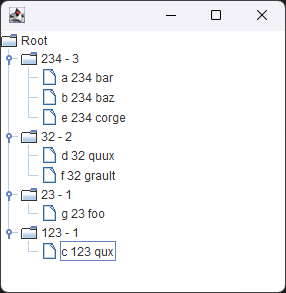

# java-regex-aggregate

## Description

todo

## Example

**Input:**

```
g 23 foo
a 234 bar
b 234 baz
c 123 qux
d 32 quux
e 234 corge
f 32 grault
```

Run: `java -jar java-regex-aggregate.jar input.txt ".*? (\d+) .*"`

**Output:**

```
0003 - 234 - a 234 bar
0002 - 32 - d 32 quux
0001 - 23 - g 23 foo
0001 - 123 - c 123 qux
Do you want to open the GUI? (y/n)
y
```


